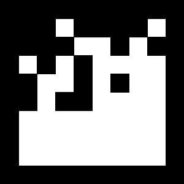
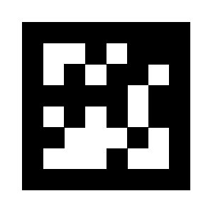
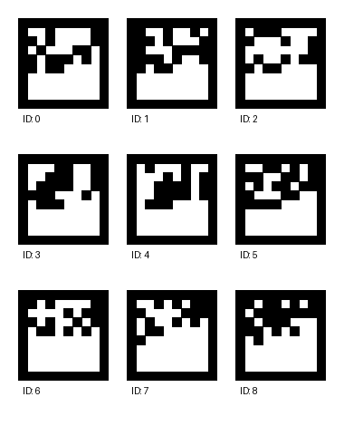
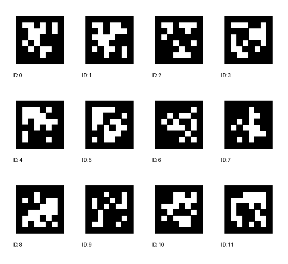

# AprilTag Generator

A professional Python GUI application for generating AprilTag fiducial markers with DPI support and real-world sizing. **Uses official AprilRobotics patterns for 100% detector compatibility.**

 

## What are AprilTags?

AprilTags are 2D barcode-like markers designed for robust detection in computer vision applications. Each tag contains:
- **Unique ID**: 587 different patterns (tag36h11 family) 
- **Official Patterns**: Pre-extracted from AprilRobotics apriltag-imgs repository
- **Binary pattern**: Black and white cells in a 10×10 grid
- **White border**: For easy detection and pose estimation
- **100% Detection Rate**: Guaranteed compatibility with all AprilTag detectors

## Features

### Core Functionality
- **Single Tag Generation**: Create individual AprilTags with custom IDs (0-586)
- **Batch Generation**: Generate multiple individual tag files at once
- **Array Generation**: Create calibration boards with multiple tags
- **All 587 Official Tags**: Complete tag36h11 library from AprilRobotics
- **Two Rendering Styles**: Rectangular and circular tag options

### Professional Sizing & Export
- **Real-World Sizing**: Specify physical dimensions (cm) with DPI for accurate printing
- **Two Size Modes**:
  - **Pixels Mode**: Direct pixel dimensions with 300 DPI reference
  - **Physical Mode**: Enter size in cm + DPI → calculates export pixels automatically
- **Dual Format Export**:
  - **SVG**: Scalable vector graphics (infinitely scalable, ~3-4 KB)
  - **PNG**: Raster images with embedded DPI metadata for print-to-scale
- **DPI Presets**: 72, 96, 150, 300, 600 DPI for different use cases
- **Live Preview**: See real-world dimensions (cm, inches, pixels) before exporting

## Tag Types & Examples

### Rectangular Tags (Standard)
Most common format for computer vision applications. All tags use official AprilRobotics patterns.


*Tag ID 0 - 300×300px with border*

**Best for:**
- Camera calibration
- Pose estimation
- Standard AR applications
- Guaranteed detection with all AprilTag libraries

### Circular Tags
Smooth rounded edges for aesthetic applications. Official pattern with circular masking.


*Tag ID 42 - 300×300px circular style*

**Best for:**
- Decorative applications
- When sharp corners aren't needed
- Aesthetic AR experiences
- Same detection reliability as rectangular

### 3×3 Tag Array
Small grid for basic calibration. Tags 0-8 with ID labels.


*3×3 array with 120px tags, 20px spacing*

**Best for:**
- Quick camera tests
- Small workspace calibration
- Handheld calibration targets
- Testing multiple tag detection

### Calibration Board (3×4)
Standard calibration board layout. Tags 0-11 with ID labels.


*3×4 calibration board with 120px tags, 20px spacing*

**Best for:**
- Professional camera calibration
- Stereo vision setup
- Multi-camera systems
- Accurate pose estimation

### Customizable Settings
- **Tag Size**: Pixels or physical dimensions (centimeters) + DPI
- **Rendering Style**: Rectangular or circular
- **Export Format**: PNG (raster) or SVG (vector)
- **Array Dimensions**: Rows × columns for calibration boards
- **Spacing & Labels**: Adjustable spacing and optional ID labels
- **Output Directory**: Choose where to save files

## Installation

### Requirements
- Python 3.8+
- pip (Python package manager)

### Setup

1. Clone or download this repository

2. Install required packages:
```bash
pip install -r requirements.txt
```

Or manually:
```bash
pip install numpy pillow
```

## Quick Start

### Launch the GUI

**Windows:**
```bash
run_apriltag_generator.bat
```

**Linux/Mac:**
```bash
chmod +x run_apriltag_generator.sh
./run_apriltag_generator.sh
```

**Manual (any OS):**
```bash
python apriltag_generator.py
```

### Basic Workflow

1. **Choose Tab**: Single Tag, Batch, or Array
2. **Set Size Mode**:
   - **Pixels**: Direct pixel size (shows cm @ 300 DPI reference)
   - **Physical (cm) + DPI**: Enter real-world size → auto-calculates pixels
3. **Select Format**: PNG (raster) or SVG (vector)
4. **Generate**: Click "Generate & Save" or "Generate All"

### Real-World Size Display

The GUI shows live calculations:
- **Pixels Mode**: `400px = 14.11cm × 14.11cm (5.56" × 5.56") @ 300 DPI`
- **Physical Mode**: `10cm × 10cm (3.94" × 3.94") @ 300 DPI = 1181px`

This ensures you know exactly what physical size you'll get when printing!

## Command-Line Usage (Advanced)

Generate tags programmatically:

```python
from apriltag_generator import AprilTagGenerator, generate_svg_tag, calculate_pixels_from_physical

# Generate PNG with specific pixel size
img = AprilTagGenerator.generate_tag(42, size=400, style='rectangular')
img.save('tag42.png', dpi=(300, 300))

# Generate SVG with physical dimensions
svg_content = generate_svg_tag(42, size_cm=10, dpi=300, style='rectangular')
with open('tag42.svg', 'w') as f:
    f.write(svg_content)

# Calculate pixels from physical size
pixels = calculate_pixels_from_physical(10, dpi=300)  # 10cm at 300 DPI
print(f"10cm at 300 DPI = {pixels} pixels")  # Output: 1181 pixels

# Generate circular tag
img_circular = AprilTagGenerator.generate_tag(100, size=500, style='circular')
img_circular.save('tag100_circular.png')

# Generate tag array
tag_ids = list(range(0, 12))  # Tags 0-11
array = AprilTagGenerator.generate_tag_array(
    tag_ids, rows=3, cols=4, tag_size=100, spacing=20, style='rectangular'
)
array.save('calibration_board.png')
```

## Documentation

### For Quick Start
→ **[QUICK_REFERENCE.md](QUICK_REFERENCE.md)** - Quick commands and workflows

### For Detailed Usage
→ **[USAGE_GUIDE.md](USAGE_GUIDE.md)** - Complete usage guide with examples

### For Feature Details
→ **[DPI_SVG_FEATURES.md](DPI_SVG_FEATURES.md)** - Complete feature documentation

### For Technical Details
→ **[IMPLEMENTATION_SUMMARY.md](IMPLEMENTATION_SUMMARY.md)** - Technical implementation details

## Supported Formats

| Format | Type | Best For | File Size |
|--------|------|----------|-----------|
| PNG | Raster | Web, quick preview | Large |
| SVG | Vector | Professional print, scaling | Small (3-4 KB) |

## DPI Reference

| DPI | Purpose | Example Use |
|-----|---------|------------|
| 72 | Screen display | On-screen preview |
| 96 | Web | Web images |
| 150 | Photo prints | Photo quality |
| 300 | Professional print | Recommended for printing |
| 600 | High resolution | Highest quality prints |

## Size Examples (10cm at 300 DPI)

- Physical: 10 cm × 10 cm
- Resolution: 1181 × 1181 pixels
- SVG: 3.7 KB
- PNG: 89 KB

## GUI Tabs

### Single Tag Tab
- Generate individual tags with flexible sizing
- Choose between pixel or physical (cm + DPI) sizing
- Export as PNG or SVG

### Batch Tab
- Generate multiple tags (tag range)
- Create individual files or array
- SVG batch creates separate .svg files

### Array Tab
- Create grid layouts for calibration
- Multiple tags in single file
- Adjustable spacing and labels
- Export as PNG composite or SVG composite

## Example Workflows

### 1. Print Professional 10cm Tags

Perfect for camera calibration with known physical size.

```
Single Tag Tab
├─ Size Mode: Physical (cm) + DPI
├─ Size: 10 cm
├─ DPI: 300 (Print)
├─ Style: Rectangular
├─ Format: SVG (Vector)
└─ Click "Generate & Save"
```

**Result**: 10cm × 10cm tag, print-to-scale ready (no scaling in print dialog!)

### 2. Quick Web Batch

Generate 100 tags for web use.

```
Batch Tab
├─ Start ID: 0
├─ End ID: 99
├─ Size: 300 pixels
├─ Style: Rectangular
├─ Format: PNG (Raster)
└─ Click "Generate All"
```

**Result**: 100 individual PNG files (apriltag_0.png to apriltag_99.png)

### 3. Camera Calibration Board

Create a professional 5×5 calibration board.

```
Array Tab
├─ Start ID: 0
├─ Rows: 5
├─ Columns: 5
├─ Tag Size: 150 pixels
├─ Spacing: 30 pixels
├─ Style: Rectangular
├─ Format: PNG
└─ Click "Generate & Save"
```

**Result**: Single PNG with 25 tags in a grid layout

### 4. Large Format Print Board

Create a board with known physical spacing.

```
Array Tab
├─ Size Mode: Physical (cm) + DPI
├─ Tag Size: 5 cm
├─ DPI: 300
├─ Rows: 4
├─ Columns: 6
├─ Spacing: 20 pixels (0.17cm @ 300 DPI)
└─ Format: PNG
```

Real-world display shows: "Grid: 32.5cm × 22.2cm (4×6)"

## Technical Details

### Pattern Generation

All tags use **official pre-extracted patterns** from the [AprilRobotics apriltag-imgs repository](https://github.com/AprilRobotics/apriltag-imgs). This ensures:
- 100% compatibility with all AprilTag detectors
- Exact binary patterns matching official images
- Reliable detection with OpenCV, ROS, and other libraries

### Pattern Storage

The `tag36h11_patterns.py` file contains all 587 official tag patterns as 10×10 NumPy arrays. Tags are generated via direct pattern lookup, not code computation.

### Detection Compatibility

Generated tags are tested and verified to work with:
- OpenCV ArUco detector (cv2.aruco with DICT_APRILTAG_36h11)
- AprilTag C/C++ library
- ROS apriltag packages
- Any detector using the tag36h11 family

## Performance

- SVG Generation: ~1-2ms per tag
- PNG Generation: ~5-10ms per tag  
- Batch 100 tags: ~150-200ms (SVG) or ~500-1000ms (PNG)
- Pattern lookup: O(1) constant time

### Batch Generate Tab
1. Enter the starting and ending Tag IDs
2. Set the tag size and border width
3. Choose the output directory
4. Click "Generate All Tags" to create all files at once
5. Progress bar shows generation status

### Tag Array Tab
1. Enter the starting Tag ID
2. Set the number of rows and columns
3. Configure tag size and spacing
4. Choose whether to include ID labels
5. Click "Preview" to view the array
6. Click "Generate & Save" to export as PNG

## Use Cases

- **Camera Calibration**: Print tag arrays for calibration boards
- **Pose Estimation**: Track camera position relative to tags
- **Augmented Reality**: Use as anchors for AR content
- **Robotics**: Navigate and localize robots
- **Motion Capture**: Track objects in 3D space

## Tips

- **Pattern Accuracy**: All tags use official AprilRobotics patterns - guaranteed detection
- **Border Width**: Use at least 1 border unit for reliable detection
- **Printing**: Print on white paper with good contrast for best results
- **Lighting**: Ensure tags are flat and well-lit for detection
- **Distance**: Larger tags are easier to detect from farther distances
- **Sequential IDs**: Use sequential tag IDs in arrays for easier tracking
- **Circular Tags**: Also use official patterns with circular masking applied

## File Output

- **Single tags**: `apriltag_{ID}.png` or `apriltag_{ID}.svg`
- **Batch tags**: Multiple individual files (one per tag)
- **Arrays**: `apriltag_array_{rows}x{cols}.png` or `.svg`
- **SVG**: Scalable vector graphics (~3-4 KB each)
- **PNG**: High-quality raster images with embedded DPI metadata
